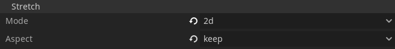

# BoxCam2D
Godot Box / Room / Grid Based Camera Node.

# Requirements:
* Godot V3.X
* Godot Project With 2D Keep Aspect.( Optional )
* 2D Scene with "Player"(Name can be different) Node.

# How To Use It:
* Copy "BoxCam2D.gd" inside your Godot Project.
* Add BoxCam2D Node using "+" or "Ctrl+A" inside root of your Scene.
* Assign your "Player" (KinematicBody2D Or RigidBody2D) Node to BoxCam2D Node using Inspector.
* Make Current True/Enabled/Ticked inside "BoxCam2D" Inspector.
* Also upate project Window Settings as shown.
* Make sure to set `Mode` to `2d` or `Viewport` and `Aspect` to `keep` in Project Settings. (Path: `Display/Window/Stretch/`)
* Checkout screenshot of Project Stretch settings below.

  

# Credits:
This asset is created during AssetJam-5. You can use this Asset in any possible way you want.
Checkout LICANCE for More Details.
If you like my work please consider following me on twitter at "https://twitter.com/samdaiyagames".
Have any query regarding this asset? Write me at sdiforalll@gmail.com
